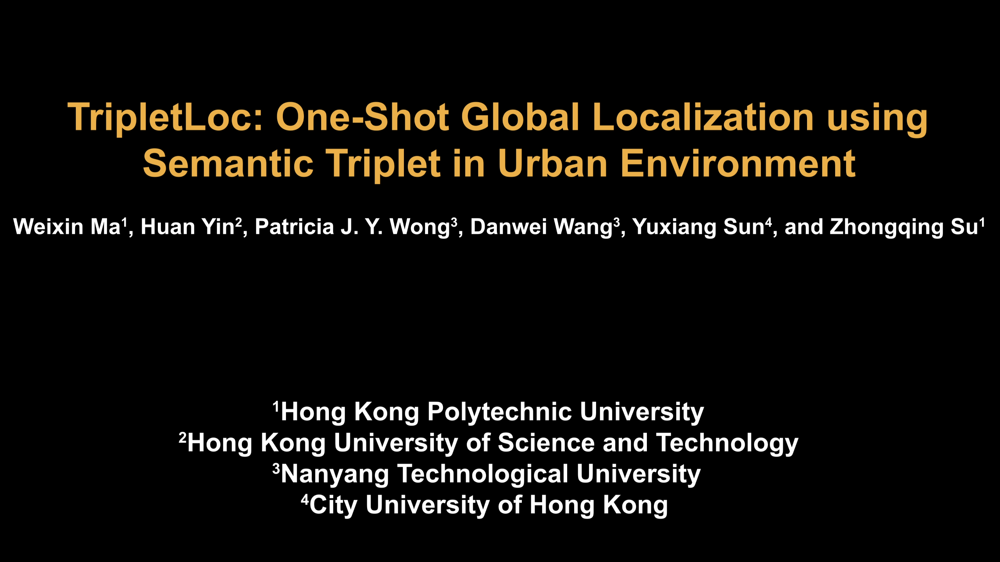
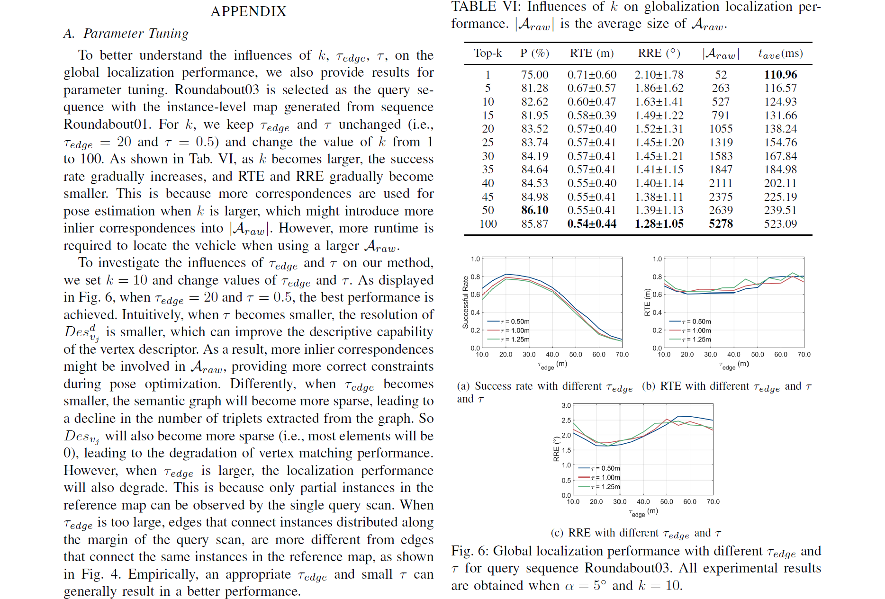

#  
 TripletLoc: One-Shot Global Localization using Semantic Triplet in Urban Environment 

The code will be open-sourced upon acceptance of the paper.

# TripletLoc
TripletLoc is a fast, efficient, and robust registration-based 6-DoF global localization method in urban environment.

A demo video can be found at: https://www.youtube.com/watch?v=3wNT82w2Z4w&t=1s  

<a href="https://www.youtube.com/watch?v=3wNT82w2Z4w&t=1s">

# Supplementary Material
Here are the supplementary material [docs/appendix.pdf](docs/appendix.pdf), which investigates the influences of $k$, $\tau_{edge}$ and $\tau$ on the global localization performance of TripletLoc. 

