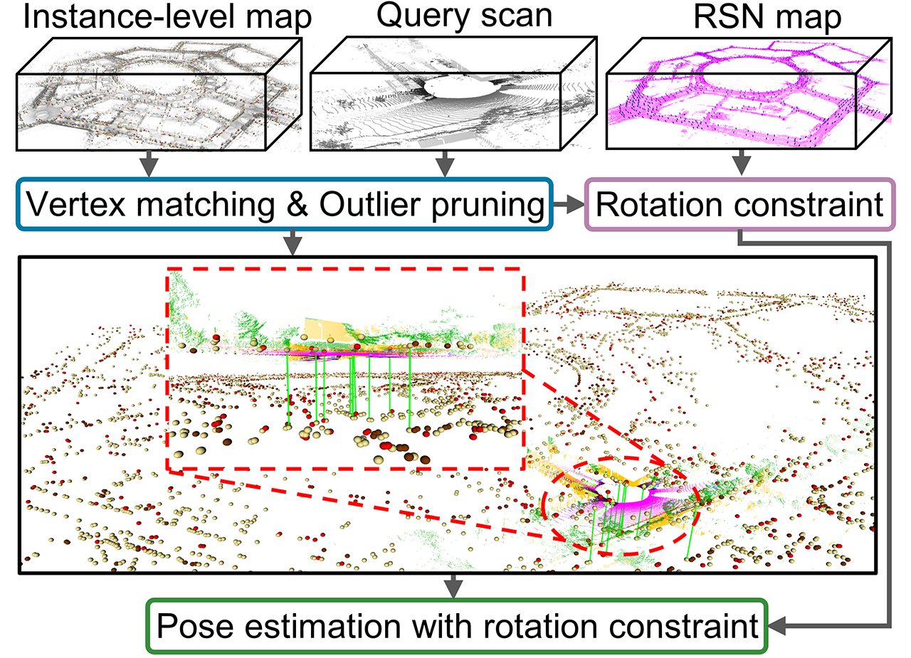

#  <p align="center"> TripletLoc: One-Shot Global Localization using Semantic Triplet in Urban Environment </p>

TripletLoc is a fast, efficient, and robust registration-based 6-DoF global localization method in urban environment, requiring no initial pose guess. [[paper]](https://ieeexplore.ieee.org/document/10816460)


<p align="center"></p>

There are two prior maps in TripletLoc, including `Instance-level map` for point-to-point constraint and `RSN map` for rotation constraint.  

* Instance map: a map containing geometric centers of instances in the surrounding envrionment.
<p align="center"></p>

* RSN map: a map capturing road surface normal, proving prior rotation constraint.
<p align="center"></p>


Localizatoin examples in HeLiPR dataset (based on our old implementation without prior rotation constratin from RSN map, values might be slightly different from results in the paper): 
<p align="center"></p>

A demo video can be found at [Youtube]( https://www.youtube.com/watch?v=3wNT82w2Z4w) (the demo is running using our old implementation without prior rotation constraint from RSN map, a higher success rate can be achieved by using RSN map.)

If you find TripletLoc helpful, please consider citing:
```bibtex
@ARTICLE{ma2024tripletloc,
  author={Ma, Weixin and Yin, Huan and Wong, Patricia J. Y. and Wang, Danwei and Sun, Yuxiang and Su, Zhongqing},
  journal={IEEE Robotics and Automation Letters}, 
  title={TripletLoc: One-Shot Global Localization Using Semantic Triplet in Urban Environments}, 
  year={2025},
  volume={10},
  number={2},
  pages={1569-1576}
```

 


# Install
## Operation system
Tested on Ubuntu 20.04.3 LTS

## Dependencies
* [ROS](https://wiki.ros.org/melodic/Installation/Ubuntu) (for PCL and Eigen)
* [GTSAM](https://github.com/borglab/gtsam) (we  are using v4.3.0, versions that support `GncOptimizer` should be fine)
* yaml-cpp `sudo apt install libyaml-cpp-dev`
* [Ceres](http://ceres-solver.org/installation.html) (for baseline `Triplet-Graph`, >= v2.2.0)

*Note that if you do not want to run baseline Triple-graph, then you do not need ceres.

## Build
```text
mkdir -p ~/tripletloc_ws/src
cd ~/tripletloc_ws/src
git clone https://github.com/Weixin-Ma/tripletloc.git
cd  tripletloc
mkdir build && cd build
cmake ..
mkdir -p ../../../build
mv pmc-src/ ../../../build/pmc-src/
cd ../../../
catkin_make -j$(nproc)
source devel/setup.bash
```

## Data preparation
* **LiDAR scans**

Please download LiDAR scans (Ouster is used) from the offical website of [HeLiPR](https://sites.google.com/view/heliprdataset/home) dataset. (We preprocess the LiDAR scans by removing points satisifying `dis>150, dis=\sqrt{p.x^2+p.y^2}`, since we found that [SPVNAS](https://github.com/mit-han-lab/spvnas) sometimes will result in errors when using the original LiDAR scans (Ouster) from HeLiPR. After filtering, everything goes well. See `preprocess_filter_pc_heliper.launch` for your reference.)

* **Semantic label**
  
We get semantic label by using the pre-trained [SPVNAS](https://github.com/mit-han-lab/spvnas) without fine-tuning. 

* **Ground truth of pose**

For your convenience, you can download all required data that we provide. [KAIST-04](https://drive.google.com/file/d/1yFJD1v15OaHgvMLzHUBQkR9NcKAhquhn/view?usp=sharing) and [Roundabout-01](https://drive.google.com/file/d/1yiY-ukHT1brO2P608wkVsg5qFk3qnZHL/view?usp=sharing) are provided for testing instance map and RSN map generation, and running `Triplet-Graph`.  [KAIST-05](https://drive.google.com/file/d/1BicR_fCtJXOaHXtC1l4Y-CFPg78wbS1M/view?usp=sharing) and [Roundabout-02](https://drive.google.com/file/d/1AU_VTjQCky9jXD2lfMqudID-Jw4bMtNQ/view?usp=sharing) are provided for one-shot relocalization test. Unzip `XXXXX.zip` to folder `src/tripletloc/test_data/`. Note that if you want to generate related maps or test relocalization with different frame interval (distance), remember to prepare requried scan file, lable file, and pose file by yourself.
 

An example of the anticipated sequence data structure is shown here:

```
📦test_data
 ┣ 📂KAIST05
   ┣ 📂LiDAR
   ┃ ┣ 📂Ouster_filterd
   ┃ ┃ ┣ 📜xxxxx.bin
   ┃ ┃ ┣ 📜xxxxx.bin
   ┃ ┃ ┗ 📜...
   ┣ 📂label
   ┃ ┣ 📜xxxxx.label
   ┃ ┣ 📜xxxxx.label
   ┃ ┗ 📜xxxxx.label
   ┣ 📂LiDAR_GT
     ┣ Ouster_gt.txt

```

`Instance-level map` and `RSN-map` for all the reference sequences are provided in this repository. Examples of the anticipated maps data structure are shown here (note that we only provide instance-level-map with trunk, pole, and traffic-sign): 

```
📦test_data
 ┣ 📂maps
    ┣ 📂Instances
    ┃  ┣ 📂KAIST04
    ┃  ┃  ┣ 15.txt
    ┃  ┃  ┣ 17.txt
    ┃  ┃  ┣ 18.txt
    ┃  ┣ 📂DCC04
    ┃  ┃  ┣ 15.txt
    ┃  ┃  ┣ 17.txt
    ┃  ┃  ┣ 18.txt
    ┃  ┣ 📂Roundabout01 
    ┃    ...
    ┣ 📂RSN
      ┣ 📂KAIST04
      ┃  ┣ road_normal.txt
      ┣ 📂DCC04
      ┃  ┣ road_normal.txt      
      ┣ 📂Roundabout01
      ┃  ┣ road_normal.txt   
        ...

``` 

## Run
*Note that you should replace file paths as yours appropriately in launch files if you want to palce your data somewhere else. 

* **(Optional, maps are all provided) Generate instance-level map and RSN map**. Please set the value in the launch file to generate `Instance-level map` or `RSN-map`. Generated maps can be found in `\test_data\maps\`.Please use the following command:
```text
roslaunch tripletloc generate_maps.launch
```

* **Run TripletLoc**. `tripletloc.launch` This launch file will run TripletLoc by step or the whole query sequence. Note that the rviz shows correct (acceptable) association in deafult. To show associations from the maximun clique, pls active topic `max_clique` and deactivate topic `correct_matches`. Please use the following command:
```text
roslaunch tripletloc tripletloc.launch
```

* **(Optional) Run baseline Triplet-Graph in a coarse-to-fine manner.** This baseline gets top-k candidates first using global descriptor extracted from the complete graph, and then run the complete process of Triplet-Graph to get the final loop closure result. Flowchart of the workflow can be found in [Triplet-Graph](https://github.com/Weixin-Ma/Triplet-Graph). It will take some time to first extract global and vertex descriptors for frames in the reference sequence. Please use the following command:
```text
roslaunch tripletloc baseline_tripletgraph.launch
```

## Evaluation
* TripleLoc

Once one-shot localization for all the query frames are done, the `success rate`, `RTE`, `RRE`, and `timecost` will be printed in the terminal. Timecost breakdown, RTE, RRE, and success rate for each query frame are aviable in `\results\TripeltLoc\run_time_breakdown.txt` and `\results\TripeltLoc\RTE_RRE_P.txt`.

* Triplet-Graph

Results for Triplet-Graph for each query frame can be found in `\results\Triplet-Graph\result.txt`

# Supported Object Classes
The current implementation supports only the following object classes: `fence`, `vegetation`, `trunk`, `pole`, and `traffic sign`. Using other object classes will result in an error. You can easily modify the code to support additional classes based on your needs.  

# Contact
If you have any questions, please contact:
* Weixin Ma [<weixin.ma@connect.polyu.hk>]


# Acknowledgement

Many thanks to the following excellent open-source projects:  

* [HeLiPR-File-Player](https://github.com/minwoo0611/HeLiPR-File-Player) : Data loader
* [Outram](https://github.com/Pamphlett/Outram) : PMC installation using CMakeLists.txt & baseline
* [TEASER++](https://github.com/MIT-SPARK/TEASER-plusplus) : MCQ-solver and TEASER++ solver
* [G3Reg](https://github.com/HKUST-Aerial-Robotics/G3Reg) : Point2PointFactor
* [SPVNAS](https://github.com/mit-han-lab/spvnas): Semantic Segmentation.

The author would like to thank Mr. [Pengyu Yin](https://pamphlett.github.io/) and Mr. [Zhijian Qiao](https://qiaozhijian.github.io/) for their kind help and disscussion.

# Supplementary Material
Here are the supplementary material [docs/appendix.pdf](docs/appendix.pdf), which investigates the influences of $k$, $\tau_{edge}$ and $\tau$ on the global localization performance of TripletLoc. 
